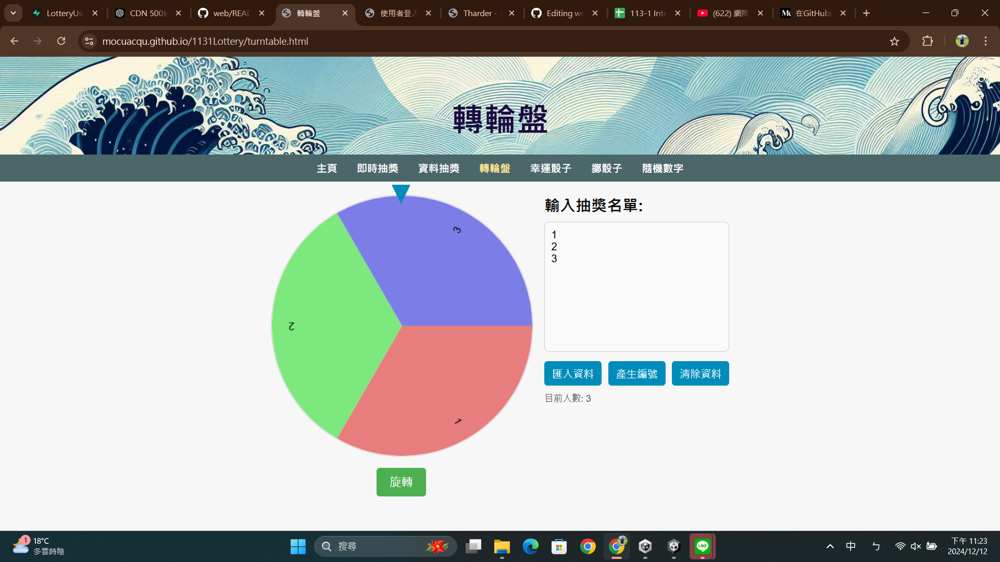

# 113-1 臺師大網際網路概論
 - 授課教師：蔡芸琤老師
 - 姓名：邱鈺婷
 - 系級：科技系116

# 作業繳交區
## HW1 個人網站
| [網頁網址](https://mocuacqu.github.io/personalWeb1/) |
|-----------------------------------------------------|

## HW2 React & JavaScript
| [網頁網址](https://mocuacqu.github.io/PL_work2_javascropt/) | [介紹影片](https://youtu.be/MRWdD7LSm78) | [與ChatGPT的對話紀錄](https://chatgpt.com/share/670a655a-97dc-800b-a431-9cda21e33264) |
|----|----|---|
## HW3 範例專案使用的介紹 & 期末專題發想的關聯
| [介紹影片](https://youtu.be/oguZPAjE9n0) | [介紹內容簡報](https://drive.google.com/file/d/1moSR0AT6iwnBppsBaIX1PIqiOayFGnGT/view?usp=sharing) | [實作程式碼](https://github.com/MocuAcqu/PL_HW3_Lottery) | [實作網址](https://plhw3lottery.onrender.com/) |
|--|--|--|--|

* 影片後半部有更新實作介紹，更新時間:2024/11/30

## HW4 將React實作架設於Render
| [實作程式碼](https://github.com/MocuAcqu/PL_HW3_Lottery) | [實作網址](https://plhw3lottery.onrender.com/) |
|--|--|

## 專題繳交區
本次期末專題，我們製作一款華麗抽獎網站，其中包含即時抽獎、資料抽獎、轉輪盤、擲骰子、隨機數字等功能。
* 抽獎網站
  | [程式碼](https://github.com/MocuAcqu/1131Lottery) | [實作網站](https://mocuacqu.github.io/1131Lottery/) | [影片解說](https://youtu.be/E1m29F7tk0Y?si=4R1AmqkEFwFT91TD) |
  |--|--|--|
* 即時抽獎-登入資料介面
  | [程式碼](https://github.com/MocuAcqu/1131Lottery-users-signIn) | [實作網站](https://mocuacqu.github.io/1131Lottery-users-signIn/) |
  |--|--|
* 畫面展示
  |  |  |  |  |  |
  |--|--|--|--|--|
## 🤝 聯絡我
如果你有任何問題或建議，隨時可以聯絡我！💬

- GitHub: [MocuAcqu](https://github.com/MocuAcqu)
- Email: [a0901422997@gmail.com](mailto:a0901422997@gmail.com) 
